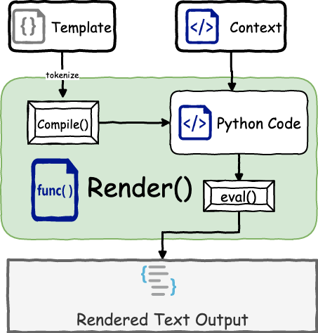

# tiny-template
Learning Project: A tiny template engine in Python

# Purpose

This is a project written for learning `template-engine` in [500lines](https://github.com/aosabook/500lines/blob/master/template-engine/template-engine.markdown) using Python3.x

# Scope

The core idea is to translate the template language into Python3 code and evaluate the code to generate the final output.

The supported template language is a nano subset of Django according to `500lines`.

For this project, we support following syntax:

- variable property accessing with dot, e.g. `var.property`
- loops: `{} ... {}`
- condition: `{} ... {}`
- comment: `{# this is comment and will not be evaluated #}`
- function call: `var|function_call` (only one parameter)

A snippet of the template

```html
<p>Welcome, {{user_name}}!</p>
<p>Products:</p>
<ul>

    
    <li>{{ product.name }}:{{ product.price|format_price }}</li>
    

</ul>
```
> The snippet may not reasonable but shows the general ideas.

And to generate the output, we would call the render function like the following:
```python
templ = "/path/to/template/file.html"

output = render(templ, user_name, product_list)
```

# Plan

0. `[DONE]` PoC, try to understand the concept with simple code
1. `[DONE]` Support variable evaluation with out dots
2. `[DONE]` Support variable evaluation with one or two dots
3. `[DONE]` Support `if` statement
4. `[DONE]` Support `for` statement
5. `[DONE]` Support nested `for` and `if` statements
6. `[DONE]` Support filters with pipes, multiple pipes
7. `[DONE]` Refactoring all codes

# Principles

Write test first, develop code later

# Analysis

The implementation is compiling engine, which means it will generate python code to finally outputs the result.

## Flowchart to show the process



## Proof of Concept

for example, in file `tests/proof_of_concept.py`

### POC Template

Here is the template defined in `templ_str`, we don't use it actually, we just want to show how the template file looks like.

```markdown
# {{title}}

> {{author_name}}



## {{section.header|to_str}}

{{section.content}}


```

We want to display the `title` and `author_name` at first, then display each section defined in the `content` strusture. For each section, we want to display its `title` as level 2 header, and the content.

### POC Render Result

The rendered output will look like following

```markdown
# Software Engineering

> Junkai Zhang

## Definition

develop a software
- option 1
- option 2

## Engineering Method

do a job

## Workflow

show a chart

tags: #software, #engineering, #SDLC
```

### POC Content Data
While the content data is like the following:

```python
context = {
    'title': 'Software Engineering',
    'author_name': 'Junkai Zhang',
    'content': [
        {
            'header': 'Definition',
            'content': 'develop a software\n- option 1\n- option 2'
        },
        {
            'header': 'Engineering Method',
            'content': "do a job"
        },
        {
            'header': 'Workflow',
            'content': 'show a chart'
        }
    ],
    'formater': int
}
```

### POC Code to output rendered result

To generate the rendered output, we have following code to process it.

```python
def test_variable_evaluation():
    result = list()

    extend_result = result.extend
    append_result = result.append
    to_str = str
    extend_result([
        '# ',
        context['title'],
        '\n\n',
        '> ',
        to_str(context['author_name']),
        '\n\n',
    ])

    for head in context['content']:
        extend_result([
            '## ',
            to_str(do_dot(head, 'header')),
            '\n\n',
            to_str(do_dot(head, 'content')),
            '\n\n'
        ])

    append_result('tags: #software, #engineering, #SDLC')

    result_str = ''.join(result)
    print(result)
```

Finally, we have the output we want show in [POC Render Result](#POC-Render-Result)

> Note, to see the result by yourself, run `pytest -s -vv tests/proof_of_concept.py`

## Design

So, our big goal now changed from "implement a template engine" to "generate python code".

Take a closer look at the code, some of lines are fixed so we have less content to worry about.

```python
def test_variable_evaluation():
    result = list()
    # <<< May need some variables definition here!! >>>
    extend_result = result.extend
    append_result = result.append
    to_str = str
    # 
    # Here is the changing part!!
    #
    result_str = ''.join(result)
    print(result)
```

The two comment area is what we need to work on. So, our work is become generate Python code lines marked in the above area.
